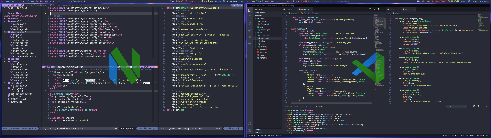

## Vscode

Copy ```settings.json``` and ```keybindings.json``` from one of the vscode folders to the respective config files on your vscode.
and then install the 
[Which Key](https://marketplace.visualstudio.com/items?itemName=VSpaceCode.whichkey)
and
[Neovim](https://marketplace.visualstudio.com/items?itemName=asvetliakov.vscode-neovim)
extensions.

This are some keybingins besides default ones:

| Key                    | Action                                 |
| ---------------------- | -------------------------------------- |
| **jk** or **kj**       | Go to normal mode (from insert)        |
| **alt + [hjkl]**       | Resize split                           |
| **control + [hjkl]**   | Navigate splits                        |
| **control + s**        | Save                                   |
| **control + q**        | Save and quit                          |
| **tab**                | Next buffer                            |
| **shift + tab**        | Previous buffer                        |
| **control + b**        | Close buffer                           |
| **shift + <** or **>** | Indent one level or remove it (visual) |
| **shift + k** or **j** | Move selected line down or up (visual) |

***Plugin keybindings***:

| Key           | Action                                        |
| ------------- | --------------------------------------------- |
| **space + f** | Fuzzy search                                  |
| **space + /** | Comment selected line or block                |
| **space + n** | Toggle NerdTree                               |
| **space + p** | Format document with prettier                 |
| **shift + k** | Function or class documentation and arg types |
